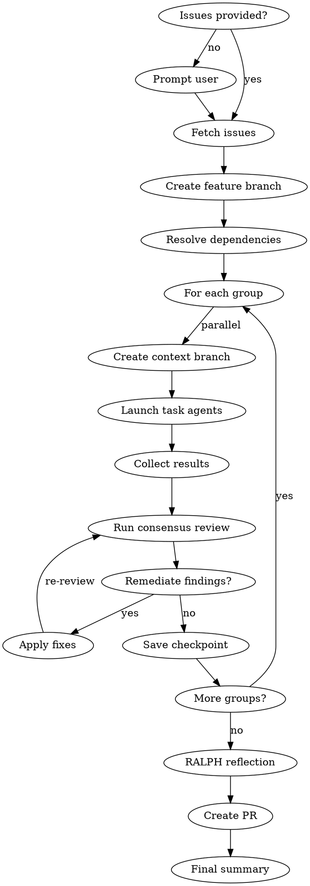

# Multi-Task Orchestration

Execute orchestration from GitHub issues or epics with parallel agents, dependency resolution, consensus reviews, and automatic remediation using contextd for memory, checkpoints, and context folding.

## Orchestration Flow



## Agents

| Agent | Purpose |
|-------|---------|
| `contextd:orchestrator` | This agent - manages workflow |
| `contextd:task-agent` | Executes individual tasks |

## Contextd Tools Required

**Memory:** `memory_search`, `memory_record`, `memory_consolidate`
**Checkpoints:** `checkpoint_save`, `checkpoint_resume`, `checkpoint_list`
**Context Folding:** `branch_create`, `branch_return`, `branch_status`
**Remediation:** `remediation_record`, `remediation_search`
**Reflection:** `reflect_analyze`, `reflect_report`

## Phase 0: Input Resolution

**If no issues provided, prompt the user:**

```
AskUserQuestion(
  questions: [{
    question: "Which issues or epic would you like to orchestrate?",
    header: "Issues",
    options: [
      { label: "Enter issue numbers", description: "Comma-separated list (e.g., 42,43,44)" },
      { label: "Select an epic", description: "Epic issue that contains sub-issues" },
      { label: "Current milestone", description: "All open issues in current milestone" }
    ],
    multiSelect: false
  }]
)
```

**For "Current milestone":**
```
gh issue list --milestone "$(gh api repos/:owner/:repo/milestones --jq '.[0].title')" --json number,title
→ Present list for confirmation
```

## Phase 1: Issue Discovery

```
1. Fetch issue details:
   gh issue view <number> --json number,title,body,labels,milestone

2. For epics (single issue with sub-issues):
   gh api graphql -f query='{ repository(owner:"X", name:"Y") {
     issue(number: N) { trackedIssues(first: 50) { nodes { number title } } }
   }}'

3. Extract task information:
   - number → Task ID
   - title → Task name
   - body → Agent prompt (look for ## Agent Prompt or ## Description)
   - labels → Priority (P0, P1, P2), type (feature, bug, etc.)
   - "Depends On: #XX" in body → Dependencies

4. Record to memory:
   memory_record(title: "Orchestration: Issues #{list}", ...)
```

## Phase 1.5: Branch Setup (MANDATORY)

**NEVER push directly to main. ALWAYS create a feature branch first.**

```
1. Generate branch name from epic/issue:
   branch_name = "feature/issue-{epic_number}-{sanitized_title}"
   Example: "feature/issue-123-locomo-benchmark"

2. Create and checkout feature branch:
   git checkout -b {branch_name}

3. Verify branch:
   git branch --show-current
   → Must NOT be "main" or "master"

4. If already on main with uncommitted changes:
   git stash
   git checkout -b {branch_name}
   git stash pop
```

**Why this matters:**
- Enables code review before merge
- Provides rollback capability
- Maintains audit trail
- Allows CI/CD validation

## Phase 2: Initialization

```
1. Read engineering practices:
   Read("CLAUDE.md"), Read("engineering-practices.md")

2. Search past orchestrations:
   memory_search(project_id, "orchestration", limit: 5)

3. If resuming:
   checkpoint_list(session_id: "orchestrate-{issue_ids}")
   checkpoint_resume(checkpoint_id)

4. Create main context branch:
   branch_create(description: "Orchestration: #{issue_ids}", budget: 16384)

5. Save initial checkpoint:
   checkpoint_save(name: "orchestrate-start")
```

## Phase 3: Dependency Resolution

```
1. Build dependency graph from issue relationships
2. Generate parallel groups (topological sort)
3. Validate no circular dependencies

Example:
  #42 depends on nothing → Group 1
  #43 depends on nothing → Group 1
  #44 depends on #42 → Group 2
  #45 depends on #43, #44 → Group 3
```

## Phase 4: Group Execution

For each group:

```
1. Create context branch (budget: 8192)
   branch_create(description: "Group {n}: #{issue_numbers}")

2. Launch parallel task agents:
   Task(
     subagent_type: "contextd:task-agent",
     prompt: |
       # Issue #{number}: {title}

       {issue_body}

       ## Contextd Integration
       - Record decisions with memory_record
       - Record fixes with remediation_record
       - Update issue with progress comments
     description: "Issue #{number}: {title}",
     run_in_background: true
   )

3. Monitor and collect results:
   TaskOutput(task_id, block=false)
   branch_status(branch_id) → check budget

4. Return from branch:
   branch_return(message: "Group complete: {summary}")
```

## Phase 5: Consensus Review

After each group:

```
1. Launch review agents in parallel:
   Task(subagent_type: "fs-dev:security-reviewer", ...)
   Task(subagent_type: "fs-dev:code-quality-reviewer", ...)

2. Collect verdicts, record to memory

3. Check threshold:
   - strict: ALL findings must be fixed
   - standard: CRITICAL/HIGH must be fixed (veto power)
   - advisory: Log only, continue
```

## Phase 6: Remediation

If findings require fixes:

```
1. Search past remediations:
   remediation_search(query: "{finding.type}")

2. Apply fixes, run tests

3. Record new remediation:
   remediation_record(error_signature, root_cause, solution)

4. Re-run review if needed
```

## Phase 7: Checkpoint

After each group passes review:

```
checkpoint_save(
  name: "group-{n}-complete",
  summary: "Completed: #{issues}, Remaining: #{remaining}"
)
```

## Phase 8: RALPH Reflection

After all groups complete:

```
1. Analyze patterns:
   reflect_analyze(project_id, period_days: 1)

2. Consolidate similar learnings:
   memory_consolidate(similarity_threshold: 0.8)

3. Generate report:
   reflect_report(format: "markdown")
```

## Phase 9: Final Summary & PR Creation

**NEVER push directly to main. ALWAYS create a pull request.**

```
1. Return from main branch:
   branch_return(message: "Orchestration complete: {metrics}")

2. Push feature branch to remote:
   git push -u origin {branch_name}

3. Create pull request:
   gh pr create \
     --title "feat: {epic_title}" \
     --body "## Summary
   Orchestrated implementation of #{epic_number}.

   ## Issues Completed
   - #{issue_list}

   ## Consensus Review
   All groups passed {threshold} review.

   ## Test Results
   {test_summary}"

4. Update issues with PR link:
   gh issue comment <number> --body "Implementation PR: #{pr_url}"

5. Record final memory:
   memory_record(title: "Orchestration Complete", outcome: "success")

6. Save final checkpoint:
   checkpoint_save(name: "orchestrate-complete")
```

**Do NOT close issues until PR is merged.**

## Issue Body Format

Issues should include an agent prompt section:

```markdown
## Description
Brief description of what this issue accomplishes.

## Agent Prompt
Detailed instructions for the task agent.

## Acceptance Criteria
- [ ] Criterion 1
- [ ] Criterion 2

## Dependencies
Depends On: #42, #43
```

## Review Thresholds

| Threshold | Behavior |
|-----------|----------|
| `strict` | 100% findings addressed before proceeding |
| `standard` | Security/vulnerability vetoes block, others advisory |
| `advisory` | Report only, continue execution |

## Resume Capability

```
/contextd:orchestrate --resume "group-2-complete"

→ Loads checkpoint state
→ Skips completed groups
→ Continues from saved point
```

## Anti-Patterns

| Pattern | Problem | Solution |
|---------|---------|----------|
| Push directly to main | Bypasses review, no rollback | ALWAYS create feature branch + PR |
| Skip input prompt | User confusion | ALWAYS use AskUserQuestion if no issues |
| Skip pre-flight | Miss past learnings | ALWAYS search memory first |
| Monolith execution | No isolation | Use context branches per group |
| Skip remediation recording | Knowledge lost | ALWAYS record fixes |
| Over-budget branches | Context overflow | Monitor with branch_status |
| Close issues before merge | Premature closure | Wait for PR merge to close issues |
