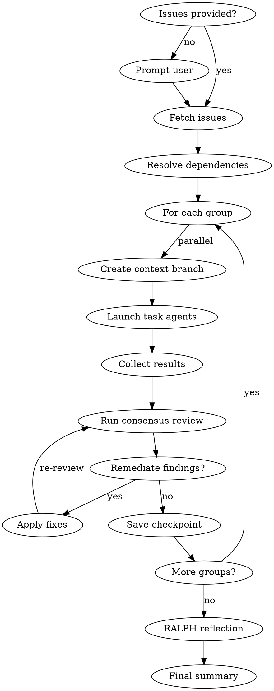

# Multi-Task Orchestration

Execute orchestration from GitHub issues or epics with parallel agents, dependency resolution, consensus reviews, and automatic remediation using contextd for memory, checkpoints, and context folding.

## Prerequisites: contextd REQUIRED

**This skill CANNOT function without contextd.**

Orchestration depends on:
- `branch_create` / `branch_return` for context isolation (CRITICAL)
- `checkpoint_save` / `checkpoint_resume` for state management
- `memory_record` for learning capture

**If contextd unavailable:**
1. STOP - inform user: "Orchestration requires contextd for context isolation"
2. Suggest: "Run `/contextd:init` to configure contextd"
3. NO FALLBACK - this skill is inoperable without contextd

## Orchestration Flow



## Agents

| Agent | Purpose |
|-------|---------|
| `contextd:orchestrator` | This agent - manages workflow |
| `contextd:task-agent` | Executes individual tasks |

## Contextd Tools Required

**Memory:** `memory_search`, `memory_record`, `memory_consolidate`
**Checkpoints:** `checkpoint_save`, `checkpoint_resume`, `checkpoint_list`
**Context Folding:** `branch_create`, `branch_return`, `branch_status`
**Remediation:** `remediation_record`, `remediation_search`
**Reflection:** `reflect_analyze`, `reflect_report`

## Phase 0: Input Resolution

**If no issues provided, prompt the user:**

```
AskUserQuestion(
  questions: [{
    question: "Which issues or epic would you like to orchestrate?",
    header: "Issues",
    options: [
      { label: "Enter issue numbers", description: "Comma-separated list (e.g., 42,43,44)" },
      { label: "Select an epic", description: "Epic issue that contains sub-issues" },
      { label: "Current milestone", description: "All open issues in current milestone" }
    ],
    multiSelect: false
  }]
)
```

**For "Current milestone":**
```
gh issue list --milestone "$(gh api repos/:owner/:repo/milestones --jq '.[0].title')" --json number,title
-> Present list for confirmation
```

## Phase 1: Issue Discovery

```
1. Fetch issue details:
   gh issue view <number> --json number,title,body,labels,milestone

2. For epics (single issue with sub-issues):
   gh api graphql -f query='{ repository(owner:"X", name:"Y") {
     issue(number: N) { trackedIssues(first: 50) { nodes { number title } } }
   }}'

3. Extract task information:
   - number -> Task ID
   - title -> Task name
   - body -> Agent prompt (look for ## Agent Prompt or ## Description)
   - labels -> Priority (P0, P1, P2), type (feature, bug, etc.)
   - "Depends On: #XX" in body -> Dependencies

4. Record to memory:
   memory_record(title: "Orchestration: Issues #{list}", ...)
```

## Phase 2: Initialization

```
1. Read engineering practices:
   Read("CLAUDE.md"), Read("engineering-practices.md")

2. Search past orchestrations:
   memory_search(project_id, "orchestration", limit: 5)

3. If resuming:
   checkpoint_list(session_id: "orchestrate-{issue_ids}")
   checkpoint_resume(checkpoint_id)

4. Create main context branch:
   branch_create(description: "Orchestration: #{issue_ids}", budget: 16384)

5. Save initial checkpoint:
   checkpoint_save(name: "orchestrate-start")
```

## Phase 3: Dependency Resolution

```
1. Build dependency graph from issue relationships
2. Generate parallel groups (topological sort)
3. Validate no circular dependencies

Example:
  #42 depends on nothing -> Group 1
  #43 depends on nothing -> Group 1
  #44 depends on #42 -> Group 2
  #45 depends on #43, #44 -> Group 3
```

## Phase 4: Group Execution

For each group:

```
1. Create context branch (budget: 8192)
   branch_create(description: "Group {n}: #{issue_numbers}")

2. Launch parallel task agents:
   Task(
     subagent_type: "contextd:task-agent",
     prompt: |
       # Issue #{number}: {title}

       {issue_body}

       ## Contextd Integration
       - Record decisions with memory_record
       - Record fixes with remediation_record
       - Update issue with progress comments
     description: "Issue #{number}: {title}",
     run_in_background: true
   )

3. Monitor and collect results:
   TaskOutput(task_id, block=false)
   branch_status(branch_id) -> check budget

4. Return from branch:
   branch_return(message: "Group complete: {summary}")
```

## Phase 5: Consensus Review

After each group:

```
1. Launch review agents in parallel:
   Task(subagent_type: "fs-dev:security-reviewer", ...)
   Task(subagent_type: "fs-dev:code-quality-reviewer", ...)

2. Collect verdicts, record to memory

3. Check threshold:
   - strict: ALL findings must be fixed
   - standard: CRITICAL/HIGH must be fixed (veto power)
   - advisory: Log only, continue
```

## Phase 6: Remediation

If findings require fixes:

```
1. Search past remediations:
   remediation_search(query: "{finding.type}")

2. Apply fixes, run tests

3. Record new remediation:
   remediation_record(error_signature, root_cause, solution)

4. Re-run review if needed
```

## Phase 7: Checkpoint

After each group passes review:

```
checkpoint_save(
  name: "group-{n}-complete",
  summary: "Completed: #{issues}, Remaining: #{remaining}"
)
```

## Phase 8: RALPH Reflection

After all groups complete:

```
1. Analyze patterns:
   reflect_analyze(project_id, period_days: 1)

2. Consolidate similar learnings:
   memory_consolidate(similarity_threshold: 0.8)

3. Generate report:
   reflect_report(format: "markdown")
```

## Phase 9: Final Summary

```
1. Return from main branch:
   branch_return(message: "Orchestration complete: {metrics}")

2. Close/update issues:
   gh issue close <number> --comment "Completed via orchestration"

3. Record final memory:
   memory_record(title: "Orchestration Complete", outcome: "success")

4. Save final checkpoint:
   checkpoint_save(name: "orchestrate-complete")
```

## Issue Body Format

Issues should include an agent prompt section:

```markdown
## Description
Brief description of what this issue accomplishes.

## Agent Prompt
Detailed instructions for the task agent.

## Acceptance Criteria
- [ ] Criterion 1
- [ ] Criterion 2

## Dependencies
Depends On: #42, #43
```

## Review Thresholds

| Threshold | Behavior |
|-----------|----------|
| `strict` | 100% findings addressed before proceeding |
| `standard` | Security/vulnerability vetoes block, others advisory |
| `advisory` | Report only, continue execution |

## Resume Capability

```
/contextd:orchestrate --resume "group-2-complete"

-> Loads checkpoint state
-> Skips completed groups
-> Continues from saved point
```

## Anti-Patterns

| Pattern | Problem | Solution |
|---------|---------|----------|
| Skip input prompt | User confusion | ALWAYS use AskUserQuestion if no issues |
| Skip pre-flight | Miss past learnings | ALWAYS search memory first |
| Monolith execution | No isolation | Use context branches per group |
| Skip remediation recording | Knowledge lost | ALWAYS record fixes |
| Over-budget branches | Context overflow | Monitor with branch_status |

---

## Resource Monitoring

### Budget Tracking

Monitor token usage across orchestration:

```json
{
  "orchestration_budget": {
    "total_tokens": 50000,
    "used_tokens": 32000,
    "remaining_tokens": 18000,
    "threshold_warning": 0.7,
    "threshold_critical": 0.9
  },
  "per_group_budget": {
    "group_1": { "allocated": 10000, "used": 8500 },
    "group_2": { "allocated": 10000, "used": 6200 },
    "group_3": { "allocated": 10000, "used": 0 }
  }
}
```

### Resource Alerts

| Alert | Trigger | Action |
|-------|---------|--------|
| `budget_warning` | 70% used | Checkpoint + notify user |
| `budget_critical` | 90% used | Checkpoint + pause + ask to continue |
| `branch_overflow` | Branch > limit | Force return, split work |

### Monitoring Loop

```
Every 5 minutes OR after each task:
  1. branch_status(branch_id) -> get token usage
  2. Compare to thresholds
  3. If warning: checkpoint_save(auto_created: true)
  4. If critical: pause, notify, wait for user
```

---

## Concurrency Limits

### Agent Pool Management

Control parallel agent execution:

```json
{
  "concurrency": {
    "max_parallel_agents": 4,
    "max_per_group": 2,
    "queue_overflow": "wait",
    "timeout_minutes": 30
  }
}
```

### Concurrency Strategies

| Strategy | Behavior | Use Case |
|----------|----------|----------|
| `unlimited` | No limits | Small orchestrations |
| `fixed` | Max N parallel | Resource constrained |
| `adaptive` | Scale based on load | Large orchestrations |

### Queue Management

When at capacity:

```
1. New tasks enter wait queue
2. FIFO by default, priority override available
3. Notify user if queue > 5 tasks
4. Timeout tasks stuck > 30 minutes
```

### Adaptive Scaling

```json
{
  "adaptive": {
    "min_agents": 1,
    "max_agents": 6,
    "scale_up_threshold": "queue > 3",
    "scale_down_threshold": "queue == 0 for 5 minutes",
    "cooldown_seconds": 60
  }
}
```

---

## Dead Letter Queue for Failed Tasks

### Failed Task Handling

Tasks that fail are moved to dead letter queue (DLQ):

```json
{
  "dlq_entry": {
    "task_id": "task_abc123",
    "issue_number": 42,
    "failure_reason": "timeout after 30 minutes",
    "error_message": "Agent did not complete within budget",
    "retry_count": 2,
    "max_retries": 3,
    "added_at": "2026-01-28T10:00:00Z",
    "last_retry_at": "2026-01-28T10:35:00Z"
  }
}
```

### DLQ Operations

| Operation | Purpose |
|-----------|---------|
| `dlq_list()` | View failed tasks |
| `dlq_retry(task_id)` | Manual retry |
| `dlq_discard(task_id)` | Remove from queue |
| `dlq_analyze()` | Pattern analysis on failures |

### Automatic Retry Policy

```json
{
  "retry_policy": {
    "max_retries": 3,
    "backoff": "exponential",
    "initial_delay_seconds": 60,
    "max_delay_seconds": 900,
    "retry_on": ["timeout", "budget_exceeded"],
    "no_retry_on": ["validation_failed", "user_cancelled"]
  }
}
```

### DLQ Alerts

```json
{
  "dlq_alerts": {
    "notify_user_after": 3,
    "auto_pause_orchestration_after": 5,
    "escalation": {
      "5_failures": "pause_and_notify",
      "10_failures": "abort_orchestration"
    }
  }
}
```

### Failure Analysis

Analyze DLQ patterns:

```
dlq_analyze() returns:
  - Most common failure reasons
  - Correlated issues (same dependency failing)
  - Time-based patterns (failures during high load)
  - Recommendations (increase budget, split issues)
```

---

## Unified Memory Type References

Tag orchestration artifacts with standard types:

| Artifact | Tag | Purpose |
|----------|-----|---------|
| Orchestration start | `type:decision`, `category:planning` | Track scope |
| Task completion | `type:learning`, `category:execution` | What worked |
| Task failure | `type:failure`, `category:execution` | What failed |
| Remediation applied | `type:remediation`, `category:fix` | Error patterns |
| Review findings | `type:pattern`, `category:quality` | Code patterns |

---

## Hierarchical Namespace Guidance

### Orchestration Namespaces

```
<org>/<project>/orchestrations/<orchestration_id>

Examples:
  fyrsmithlabs/contextd/orchestrations/epic-42
  fyrsmithlabs/marketplace/orchestrations/v1.6-release
```

### Nested Task Namespaces

```
<orchestration_namespace>/groups/<group_id>/tasks/<task_id>

Example:
  fyrsmithlabs/contextd/orchestrations/epic-42/groups/1/tasks/issue-43
```

---

## Audit Fields

All orchestration records include:

| Field | Description | Auto-set |
|-------|-------------|----------|
| `created_by` | Orchestrator session | Yes |
| `created_at` | Start timestamp | Yes |
| `completed_at` | End timestamp | Yes |
| `duration_seconds` | Total execution time | Yes |
| `task_count` | Number of tasks | Yes |
| `success_count` | Completed tasks | Yes |
| `failure_count` | Failed tasks | Yes |

---

## Claude Code 2.1 Patterns

### Background Task Execution

Launch tasks without blocking orchestrator:

```
task_42 = Task(
  subagent_type: "contextd:task-agent",
  prompt: "Execute issue #42",
  run_in_background: true,
  description: "Issue #42: Add user authentication"
)

task_43 = Task(
  subagent_type: "contextd:task-agent",
  prompt: "Execute issue #43",
  run_in_background: true,
  description: "Issue #43: Add role-based access"
)

// Orchestrator continues monitoring...
```

### Task Dependencies with addBlockedBy

Chain dependent tasks:

```
# Group 1 (parallel - no dependencies)
task_42 = Task(prompt: "Issue #42")
task_43 = Task(prompt: "Issue #43")

# Group 2 (depends on #42)
task_44 = Task(prompt: "Issue #44", addBlockedBy: [task_42.id])

# Group 3 (depends on #43 and #44)
task_45 = Task(prompt: "Issue #45", addBlockedBy: [task_43.id, task_44.id])
```

### PreToolUse Hook for Orchestration Safety

Prevent dangerous operations during orchestration:

```json
{
  "hook_type": "PreToolUse",
  "tool_name": "Bash",
  "condition": "orchestration_active AND command.matches('git push --force|rm -rf')",
  "prompt": "Dangerous operation during orchestration. Checkpoint first and confirm with user."
}
```

### PostToolUse Hook for Task Completion

Auto-record task completions:

```json
{
  "hook_type": "PostToolUse",
  "tool_name": "Task",
  "condition": "task_completed AND orchestration_active",
  "prompt": "Task completed. Record to memory_record and update orchestration progress."
}
```

---

## Event-Driven State Sharing

Orchestration emits events for other skills:

```json
{
  "event": "orchestration_started",
  "payload": {
    "orchestration_id": "epic-42",
    "issues": [42, 43, 44, 45],
    "groups": 3,
    "estimated_duration": "2 hours"
  },
  "notify": ["workflow", "consensus-review"]
}
```

Subscribe to orchestration events:
- `orchestration_started` - Orchestration began
- `group_started` - Group execution began
- `task_started` - Individual task began
- `task_completed` - Task finished (success or failure)
- `task_failed` - Task moved to DLQ
- `group_completed` - All tasks in group done
- `review_triggered` - Consensus review started
- `orchestration_paused` - Budget/failure pause
- `orchestration_completed` - All groups done
