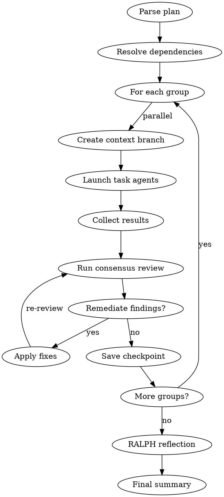

# Multi-Task Orchestration

Execute orchestration plans with parallel agents, dependency resolution, consensus reviews, and automatic remediation using contextd for memory, checkpoints, and context folding.

## Orchestration Flow



## Agents

| Agent | Purpose |
|-------|---------|
| `contextd:orchestrator` | This agent - manages workflow |
| `contextd:task-agent` | Executes individual tasks |

## Contextd Tools Required

**Memory:** `memory_search`, `memory_record`, `memory_consolidate`
**Checkpoints:** `checkpoint_save`, `checkpoint_resume`, `checkpoint_list`
**Context Folding:** `branch_create`, `branch_return`, `branch_status`
**Remediation:** `remediation_record`, `remediation_search`
**Reflection:** `reflect_analyze`, `reflect_report`

## Phase 0: Initialization

```
1. Read engineering practices:
   Read("CLAUDE.md"), Read("engineering-practices.md")

2. Search past orchestrations:
   memory_search(project_id, "orchestration <plan>", limit: 5)

3. If resuming:
   checkpoint_list(session_id: "orchestrate-<plan>")
   checkpoint_resume(checkpoint_id)

4. Create main context branch:
   branch_create(description: "Orchestration: <plan>", budget: 16384)

5. Save initial checkpoint:
   checkpoint_save(name: "orchestrate-start")
```

## Phase 1: Plan Discovery

```
1. Read plan file (or glob for *-PLAN.md)
2. Extract: tasks, dependencies, groups, success criteria
3. Record plan analysis to memory
```

## Phase 2: Dependency Resolution

```
1. Build dependency graph
2. Generate parallel groups (topological sort)
3. Validate no circular dependencies
```

## Phase 3: Group Execution

For each group:

```
1. Create context branch (budget: 8192)
   branch_create(description: "Group {n}")

2. Launch parallel task agents:
   Task(
     subagent_type: "contextd:task-agent",
     prompt: "{task.prompt}\n\n## Contextd Integration\n- Record decisions with memory_record\n- Record fixes with remediation_record",
     run_in_background: true
   )

3. Monitor and collect results:
   TaskOutput(task_id, block=false)
   branch_status(branch_id) → check budget

4. Return from branch:
   branch_return(message: "Group complete: {summary}")
```

## Phase 4: Consensus Review

After each group:

```
1. Launch review agents in parallel:
   Task(subagent_type: "fs-dev:security-reviewer", ...)
   Task(subagent_type: "fs-dev:code-quality-reviewer", ...)

2. Collect verdicts, record to memory

3. Check threshold:
   - strict: ALL findings must be fixed
   - standard: CRITICAL/HIGH must be fixed (veto power)
   - advisory: Log only, continue
```

## Phase 5: Remediation

If findings require fixes:

```
1. Search past remediations:
   remediation_search(query: "{finding.type}")

2. Apply fixes, run tests

3. Record new remediation:
   remediation_record(error_signature, root_cause, solution)

4. Re-run review if needed
```

## Phase 6: Checkpoint

After each group passes review:

```
checkpoint_save(
  name: "group-{n}-complete",
  summary: "Completed: {tasks}, Remaining: {remaining}"
)
```

## Phase 7: RALPH Reflection

After all groups complete:

```
1. Analyze patterns:
   reflect_analyze(project_id, period_days: 1)

2. Consolidate similar learnings:
   memory_consolidate(similarity_threshold: 0.8)

3. Generate report:
   reflect_report(format: "markdown")
```

## Phase 8: Final Summary

```
1. Return from main branch:
   branch_return(message: "Orchestration complete: {metrics}")

2. Record final memory:
   memory_record(title: "Orchestration Complete", outcome: "success")

3. Save final checkpoint:
   checkpoint_save(name: "orchestrate-complete")
```

## Plan File Format

```markdown
# Phase X Orchestration Plan

**Agents:** contextd:orchestrator + contextd:task-agent

## Tasks

### Task 1: Feature Name
**Priority:** P0
**Depends On:** None

#### Agent Prompt
[Task instructions with RALPH requirements]

### Task 2: Another Feature
**Depends On:** Task 1
...

## Parallel Groups
- **Group 1:** Task 1, Task 2 (parallel)
- **Group 2:** Task 3 (after Group 1)
```

## Review Thresholds

| Threshold | Behavior |
|-----------|----------|
| `strict` | 100% findings addressed before proceeding |
| `standard` | Security/vulnerability vetoes block, others advisory |
| `advisory` | Report only, continue execution |

## Resume Capability

```
/orchestrate --resume "group-2-complete"

→ Loads checkpoint state
→ Skips completed groups
→ Continues from saved point
```

## Anti-Patterns

| Pattern | Problem | Solution |
|---------|---------|----------|
| Skip pre-flight | Miss past learnings | ALWAYS search memory first |
| Monolith execution | No isolation | Use context branches per group |
| Skip remediation recording | Knowledge lost | ALWAYS record fixes |
| Over-budget branches | Context overflow | Monitor with branch_status |
